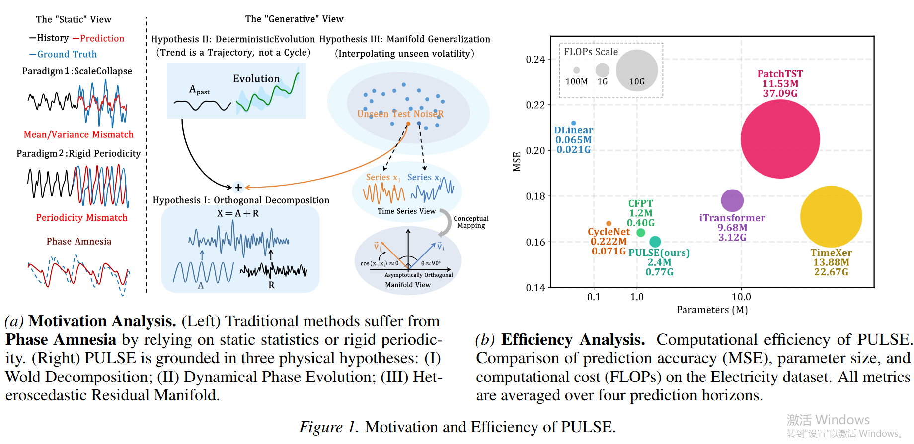
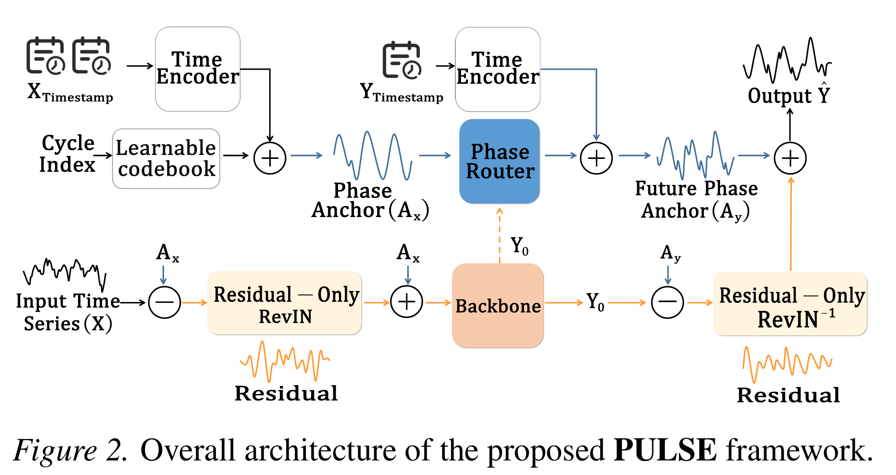
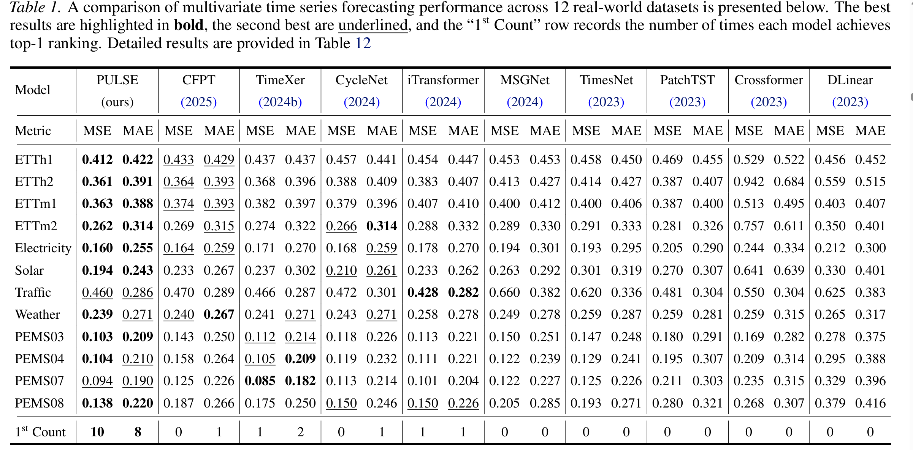
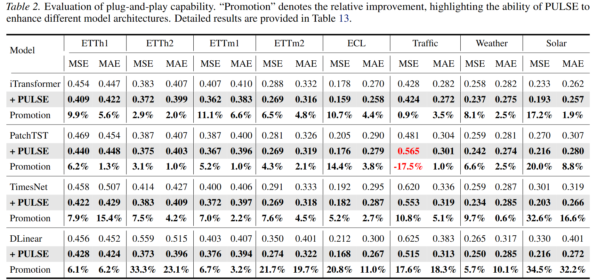
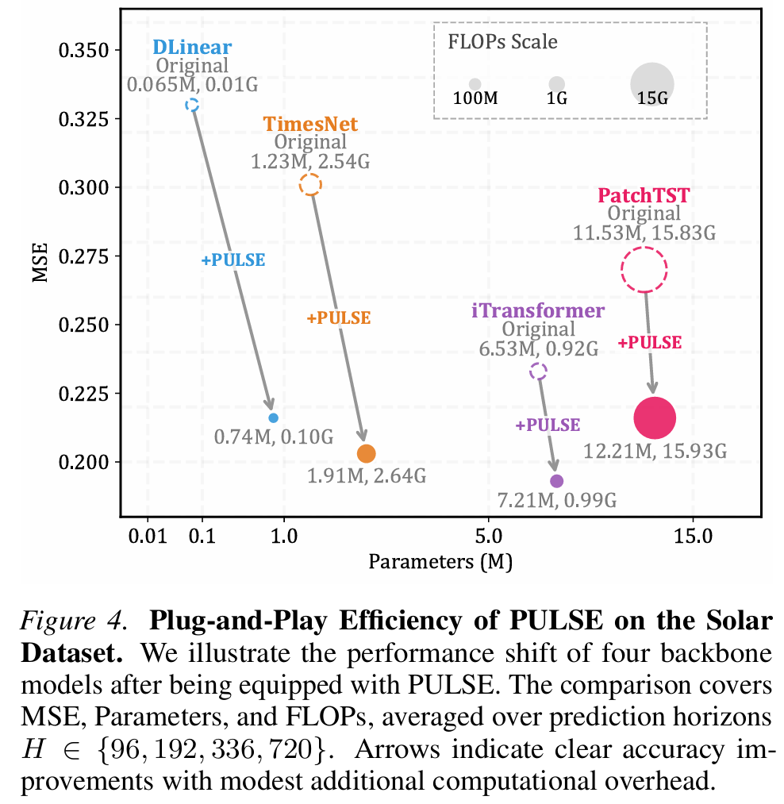
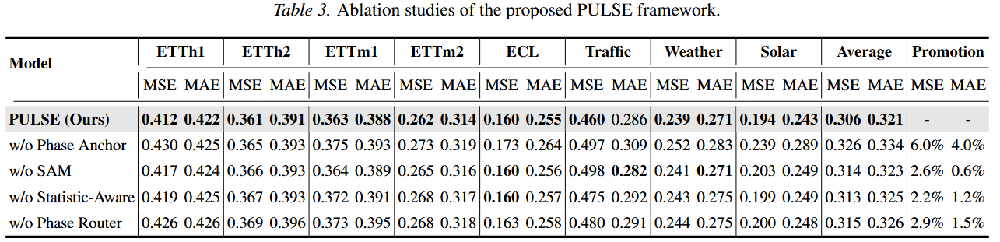
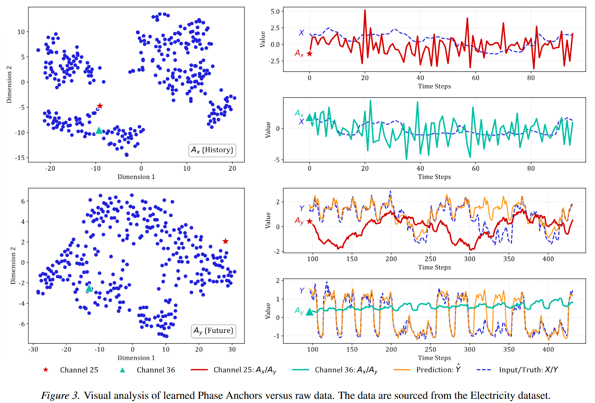
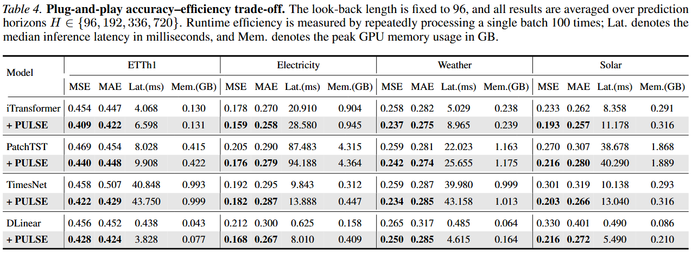

# PULSE: Generative Phase Evolution for Non-Stationary Time Series Forecasting

<p align="center">
  
</p>

This is the official implementation of **PULSE: Generative Phase Evolution for Non-Stationary Time Series Forecasting**.

PULSE is a physics-informed framework for non-stationary time series forecasting. It shifts forecasting from **passive historical fitting** to **generative phase evolution**, enabling a lightweight backbone to model evolving temporal structures under distribution shifts.

---

## Overview

Time series forecasting under non-stationarity requires models to capture stable temporal structures while adapting to future distribution shifts. Existing methods often rely on static assumptions, such as restoring future statistics from historical windows or directly copying historical periodic patterns. These assumptions may cause **Phase Amnesia**, where models lose awareness of the evolving global temporal context.

PULSE follows a simple design philosophy:

```text
Disentangle → Evolve → Simulate
```

It contains three key components:

- **Phase-Anchored Disentanglement:** separates deterministic phase structures from stochastic residual fluctuations.
- **Generative Phase Router:** generates future phase trajectories instead of rigidly copying historical patterns.
- **Statistic-Aware Mixup:** simulates residual distribution shifts while avoiding artificial scale collapse.

---

## Framework

<p align="center">
  
</p>

Given a historical sequence, PULSE first constructs a deterministic phase anchor and extracts the residual component:

```text
Historical Input = Phase Anchor + Residual
```

Unlike standard normalization methods that normalize the raw sequence directly, PULSE normalizes only the stochastic residual while preserving the deterministic phase anchor. The Phase Router then evolves the historical phase anchor into a future-oriented phase anchor, which is injected back during denormalization to reconstruct the final prediction.

---

## Main Results

PULSE is evaluated on **12 real-world multivariate time series forecasting datasets**, covering both long-term and short-term forecasting scenarios.

```text
MSE:   10 / 12 first-place results
MAE:    8 / 12 first-place results
Total: 18 / 24 first-place entries
```

<p align="center">
  
</p>

---

## Plug-and-Play Capability

PULSE can also be used as a plug-and-play enhancement module for existing forecasting backbones, including **DLinear**, **PatchTST**, **TimesNet**, and **iTransformer**.

<p align="center">
  
</p>

<p align="center">
  
</p>

---

## Ablation Study

The ablation results validate the contribution of each component. Removing the **Phase Anchor** causes the largest degradation, while removing the **Phase Router** or **Statistic-Aware Mixup** also weakens forecasting performance and robustness.

<p align="center">
  
</p>

---

## Phase Evolution Visualization

PULSE does not simply copy historical patterns. Instead, it learns future-oriented phase evolution and maps similar historical anchors to different future phase trajectories when their future dynamics diverge.

<p align="center">
  
</p>

---

## Accuracy--Efficiency Trade-Off

Besides forecasting accuracy, we report actual inference latency and peak GPU memory usage. PULSE improves forecasting accuracy with modest runtime and memory overhead, making it a practical plug-and-play module.

<p align="center">
  
</p>

---

## Requirements

Create the environment with Conda:

```bash
conda create -n PULSE python=3.8
conda activate PULSE
pip install -r requirements.txt
```

Main dependencies:

```text
numpy
matplotlib
pandas
scikit-learn
torch
```

---

## Data Preparation

All datasets used in the experiments can be downloaded from:

```text
https://drive.usercontent.google.com/download?id=1l51QsKvQPcqILT3DwfjCgx8Dsg2rpjot&export=download&authuser=0
```

These datasets are provided by the official iTransformer repository.

After downloading the datasets, create a folder named `all_datasets/` in the root directory and place all dataset files directly into this folder.

```text
PULSE/
├── all_datasets/
│   ├── ETTh1.csv
│   ├── ETTh2.csv
│   ├── ETTm1.csv
│   ├── ETTm2.csv
│   ├── electricity.csv
│   ├── traffic.csv
│   ├── weather.csv
│   ├── solar_AL.txt
│   ├── PEMS03.npz
│   ├── PEMS04.npz
│   ├── PEMS07.npz
│   └── PEMS08.npz
```

Please make sure that the dataset filenames are consistent with the `data_path_name` specified in each script under `scripts/`.

---

## Dataset Summary

| Dataset | File Name | Variables | Prediction Lengths | Script |
| --- | --- | ---: | --- | --- |
| ETTh1 | `ETTh1.csv` | 7 | 96, 192, 336, 720 | `scripts/ETTh1.sh` |
| ETTh2 | `ETTh2.csv` | 7 | 96, 192, 336, 720 | `scripts/ETTh2.sh` |
| ETTm1 | `ETTm1.csv` | 7 | 96, 192, 336, 720 | `scripts/ETTm1.sh` |
| ETTm2 | `ETTm2.csv` | 7 | 96, 192, 336, 720 | `scripts/ETTm2.sh` |
| Electricity | `electricity.csv` | 321 | 96, 192, 336, 720 | `scripts/electricity.sh` |
| Traffic | `traffic.csv` | 862 | 96, 192, 336, 720 | `scripts/traffic.sh` |
| Weather | `weather.csv` | 21 | 96, 192, 336, 720 | `scripts/Weather.sh` |
| Solar | `solar_AL.txt` | 137 | 96, 192, 336, 720 | `scripts/Solar.sh` |
| PEMS03 | `PEMS03.npz` | 358 | 12, 24, 48, 96 | `scripts/PEMS03.sh` |
| PEMS04 | `PEMS04.npz` | 307 | 12, 24, 48, 96 | `scripts/PEMS04.sh` |
| PEMS07 | `PEMS07.npz` | 883 | 12, 24, 48, 96 | `scripts/PEMS07.sh` |
| PEMS08 | `PEMS08.npz` | 170 | 12, 24, 48, 96 | `scripts/PEMS08.sh` |

Default setting:

```text
seq_len = 96
metrics = MSE, MAE
```

---

## Training

All training scripts are provided in the `scripts/` folder.

To reproduce the results on ETTh1, run:

```bash
bash ./scripts/ETTh1.sh
```

To run other datasets:

```bash
bash ./scripts/ETTh2.sh
bash ./scripts/ETTm1.sh
bash ./scripts/ETTm2.sh
bash ./scripts/electricity.sh
bash ./scripts/traffic.sh
bash ./scripts/Weather.sh
bash ./scripts/Solar.sh
bash ./scripts/PEMS03.sh
bash ./scripts/PEMS04.sh
bash ./scripts/PEMS07.sh
bash ./scripts/PEMS08.sh
```

To run all scripts sequentially:

```bash
for script in ./scripts/*.sh; do
    bash "$script"
done
```

---

## Custom Usage

You can modify the corresponding shell script in `scripts/` to customize the dataset, prediction length, batch size, learning rate, and GPU index.

A typical command is:

```bash
python -u run.py \
  --is_training 1 \
  --root_path ./all_datasets/ \
  --data_path ETTh1.csv \
  --model PULSE \
  --data ETTh1 \
  --features M \
  --seq_len 96 \
  --pred_len 96 \
  --enc_in 7 \
  --gpu 0
```

Common arguments:

| Argument | Description |
| --- | --- |
| `--model` | Model name, e.g., `PULSE` |
| `--root_path` | Root directory of dataset files |
| `--data_path` | Dataset filename |
| `--data` | Dataset type |
| `--seq_len` | Historical look-back length |
| `--pred_len` | Prediction length |
| `--enc_in` | Number of input variables |
| `--gpu` | GPU index |

---

## Assets

All README figures and tables should be placed under `assets/`.

```text
assets/
├── fig1_motivation_efficiency.png
├── fig2_framework.png
├── fig3_phase_anchor_visualization.png
├── fig4_plug_and_play_efficiency.png
├── table1_main_results.png
├── table2_plug_and_play.png
├── table3_ablation.png
└── table4_efficiency_tradeoff.png
```

These files are only used for README visualization and are not required for training or evaluation.

---

## Citation

If you find this repository useful, please cite our paper:

```bibtex
@inproceedings{liu2026pulse,
  title     = {PULSE: Generative Phase Evolution for Non-Stationary Time Series Forecasting},
  author    = {Liu, Yangyou and Shao, Zezhi and Chen, Xinyu and Chen, Hu and Wang, Fei and Wu, Yuankai},
  booktitle = {Forty-third International Conference on Machine Learning},
  year      = {2026}
}
```

---

## Acknowledgement

We sincerely thank the following repositories and benchmark suites for their valuable code bases and datasets:

```text
https://github.com/thuml/iTransformer
https://github.com/thuml/Time-Series-Library
https://github.com/yuqinie98/PatchTST
https://github.com/cure-lab/LTSF-Linear
https://github.com/zhouhaoyi/Informer2020
https://github.com/thuml/Autoformer
```

---

## Contact

For questions or discussions, please contact:

```text
Yangyou Liu: 2024223045153@stu.scu.edu.cn
```
